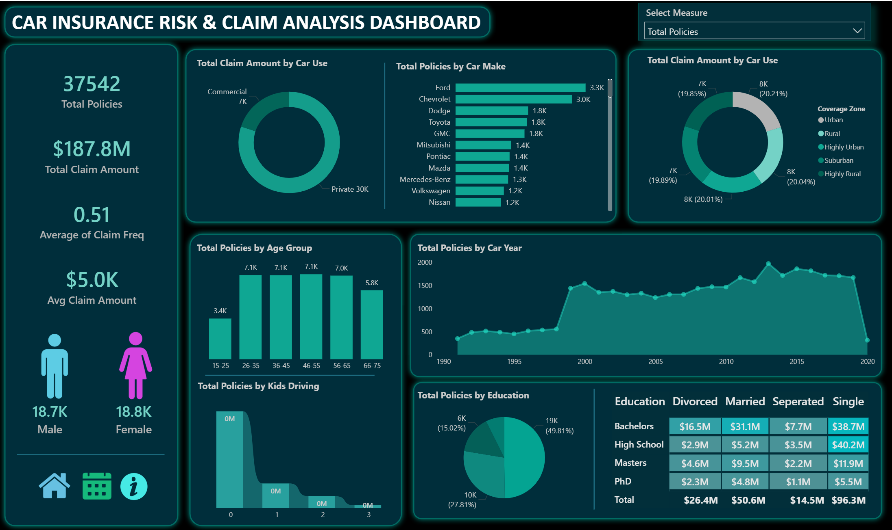

# 🚗 Car Insurance Risk & Claim Analysis Dashboard



---

## 📌 Project Overview

End-to-end data analytics project on car insurance policies — from raw data cleaning in Excel to an interactive Power BI dashboard.

**Dataset:** [Car Insurance Policies — Kaggle (nidhiy07)](https://www.kaggle.com/datasets/nidhiy07/car-insurance-policies)

---

## 📊 Dashboard Highlights

| Metric | Value |
|---|---|
| 🗂️ Total Policies | 37,542 |
| 💰 Total Claim Amount | $187.8M |
| 📉 Avg Claim Amount | $5.0K |
| 🔁 Avg Claim Frequency | 0.51 |
| 👨 Male Policyholders | 18.7K |
| 👩 Female Policyholders | 18.8K |

---

## 🛠️ Steps Followed

### 1. Excel — Data Cleaning
- Converted **Birth Date** from text to actual date using **Text to Columns** (MDY format)
- Used `PROPER()` function to fix column name casing
- Used **Ctrl+H** to replace underscores `_` with spaces in column names
- Reordered columns using **Cut → Insert Cut Cells**

### 2. Python (Pandas) — Data Validation
```python
import pandas as pd

df = pd.read_excel('Clean_Car_Insurance.xlsx')

# Check null values
print(df.isnull().sum())

# Check & remove duplicates
print("Duplicates:", df.duplicated().sum())
df.drop_duplicates(inplace=True)

# Verify data types
print(df.dtypes)
```

### 3. Power BI — Transformation & Dashboard
- Transformed data types in **Power Query**
- Created new calculated columns and measures using **DAX**:

```dax
// Age Calculated Column
Age = DATEDIFF(Clean_Car_Insurance_Policy[Birth Date], TODAY(), YEAR)

// Age Group Column
Age Group = SWITCH(TRUE(),
    [Age] <= 25, "15-25",
    [Age] <= 35, "26-35",
    [Age] <= 45, "36-45",
    [Age] <= 55, "46-55",
    [Age] <= 65, "56-65", "66-75"
)

// Total Claim Measure
Total Claim = SUM(Clean_Car_Insurance_Policy[Claim Amount])

// Avg Claim Amount
Avg Claim Amount = AVERAGE(Clean_Car_Insurance_Policy[Claim Amount])
```

---

## 🔍 Key Insights

- 🚗 **Ford ($16.6M)** and **Chevrolet ($14.8M)** are the top claim brands
- 🌍 All 5 coverage zones share claims nearly equally (~19–20% each)
- 👥 Age group **36–55** has the highest claim amounts (~$36M each)
- 🎓 **High School + Single** segment has the highest claims at **$40.2M**
- 📅 Cars manufactured between **2005–2015** show peak claim amounts
- 🚘 **Private use** vehicles dominate total claims at **$150.4M**

---

## 🧰 Tech Stack

| Tool | Purpose |
|---|---|
| Microsoft Excel | Data Cleaning |
| Python · Pandas | Data Validation |
| Power BI | Dashboard & Visualization |
| Power Query | Data Type Transformation |
| DAX | Calculated Columns & Measures |

---

## 📬 Dataset Source

> **Kaggle:** https://www.kaggle.com/datasets/nidhiy07/car-insurance-policies
